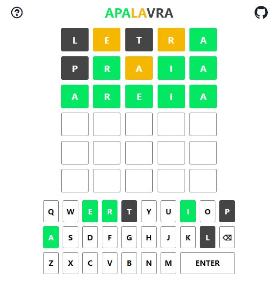

# apalavra

<b>apalavra</b> é um jogo de adivinhar palavras da lingua portuguesa (pt-BR). As palavras podem ter 5 ou 6 letras e você tem 6 chances para descobrir. A cada dia é publicada uma nova palavra.

Inspirado nos jogos [Wordle](https://www.nytimes.com/games/wordle/index.html), [Termo](https://term.ooo/) e [Letreco](https://www.gabtoschi.com/letreco/).

Desenvolvido com [Next.js](https://nextjs.org/) e [Chakra UI](https://chakra-ui.com/).